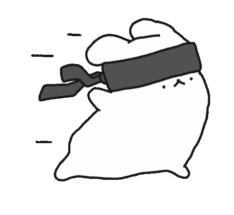

# Hi, I'm Danny 👋

I'm a software engineer passionate about solving complex problems, learning new technologies, building scalable software and contributing to open-source projects. I also do Gym 💪, Music 🎼 and Gardening 🧑‍🌾.

🌐 [Portfolio](https://tu-portfolio.com) · 💼 [LinkedIn](https://linkedin.com/in/tu-usuario) · ✉️ [Email](mailto:thevelika@hotmail.com)

  
  
  
  
  

## Projects / Start Here

- 
- 
- 

## Tech Stack

- **Languages:** Python, TypeScript, JavaScript, Java, Rust
- **Backend & APIs:** Node.js, FastAPI
- **Frontend:** React, HTML5, CSS3 / Tailwind CSS
- **DevOps & Tools:** Docker, Git, GitHub Actions

## Contact

Feel free to contact me at anytime, I enjoy talking about any topic in life. The best way to do so is usually by email.

  

